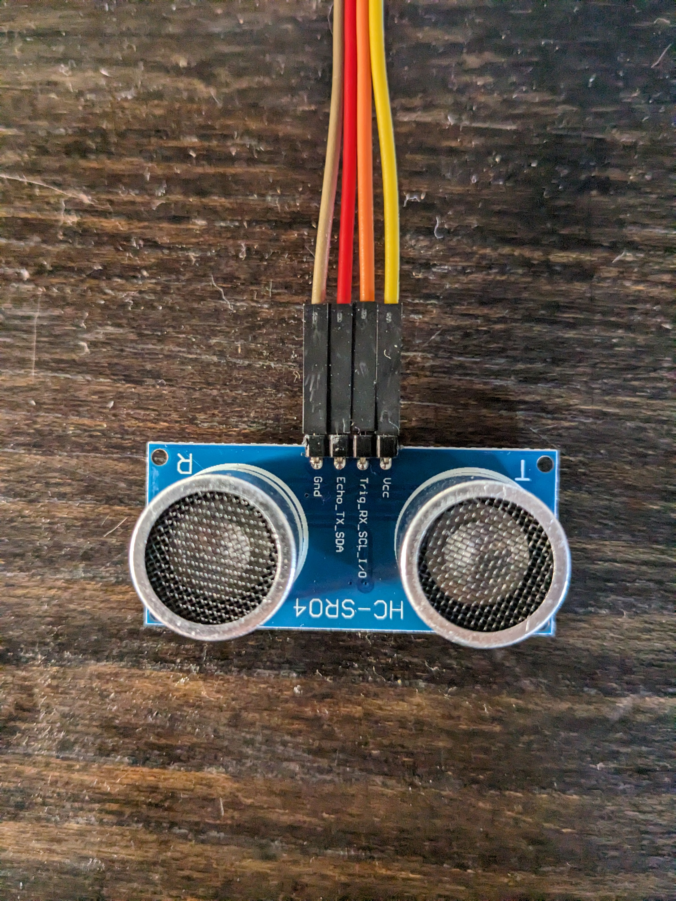
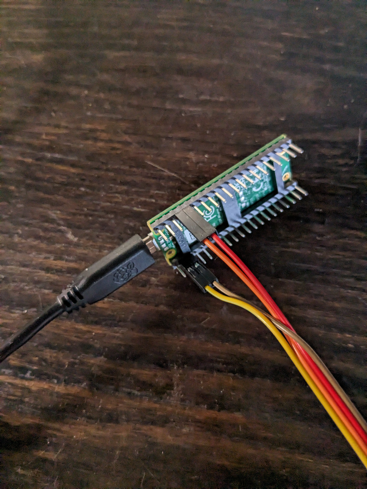
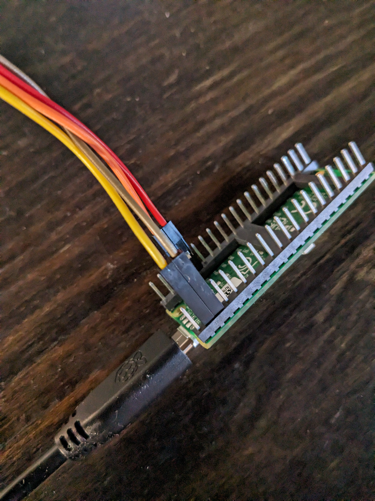

## Raspberry Pi Pico + HC-SR04 sensor + MQTT

A rust program that sends HC-SR04 (Ultrasonic distance sensor) data
to an MQTT broker.

Use cases include intrusion detection, water level monitoring and others.

### Get Started

```shell
git clone git@github.com:Benehiko/pico-ultrasonic-rs.git && cd pico-ultrasonic-rs/
```

You need to install [rust](https://www.rust-lang.org/tools/install) and install 
[elf2uf2-rs](https://docs.rs/crate/elf2uf2-rs/latest).

```shell
cargo install elf2uf2-rs --locked
```

Since the pico has a different architecture than your development
machine, you will need to install the rust toolchain for
`thumbv6m-none-eabi`.

```shell
rustup target add thumbv6m-none-eabi
```

For more detailed instructions, please take a look at
[The Embedded Rust Book](https://docs.rust-embedded.org/book/intro/index.html).

To compile the program you need to export some environment variables that
will be baked into the compiled application.

```shell
export RP_WIFI_NETWORK="MySSID"
export RP_WIFI_PASSWORD="1234"
export RP_MQTT_SERVER_IP=192.168.1.100
export RP_MQTT_SERVER_PORT=9000
export RP_MQTT_USERNAME="foo"
export RP_MQTT_PASSWORD="bar"
```

* `MQTT_USERNAME`, `MQTT_PASSWORD` and `MQTT_SERVER_PORT` are optional.

After you have installed all the required dependencies on your OS, run

```shell
# mount the pico (press and hold bootsel while powering on)
cargo run --release --bin pico-ultrasonic-rs
```

You need an MQTT broker. For quick testing on your local network, spin up a [mosquitto](https://mosquitto.org/) instance.

```
printf '%s\n' 'listener 1883' 'allow_anonymous true' 'max_keepalive 43200' > mosquitto.conf
mosquitto -c mosquitto.conf
```

Then listen on the `pico` topic on your machine or another local network device.

```
mosquitto_sub -p 1883 -t "pico"
```

### Wiring up your Pico

You can use a breadboard, but I used female to female jumper
cables.







Sensor | Pico

VCC -> VSYS (5V)
GND -> GND
Trigger -> GP2
Echo -> GP3

### Local embassy

The program uses the [`embassy-rs/embassy`](https://github.com/embassy-rs/embassy)
packages for the WIFI drivers and GPIO interface. 

Sometimes it's necessary to clone embassy to your machine when developing.

```shell
git clone git@github.com:embassy-rs/embassy.git
```

Ensure that you clone this repository in the same root directory as embassy,
otherwise it won't build.

```
-- root
    -- embassy
    -- rp-ultrasonic-rs
```

Then add the `path` property inside the `Cargo.toml` file with relative paths.

```diff
[dependencies.embassy-rp]
version = "0.1.0"
features = ["defmt", "unstable-pac", "time-driver", "critical-section-impl"]
+ path = "../embassy/embassy-rp/"
```

### Developing against your Pico

The Pico needs to be mounted as a storage device on your 
development machine.

Press and hold the `BOOTSEL` button on the pico while plugging
the USB cable into your host machine.

It will immediately come up as a mounted storage drive.

Next, you will need to run `cargo run` which will flash the Pico
with the latest build and output the logs from the Pico over serial. 

```shell
cargo run --bin pico-ultrasonic-rs
```

Since this is an embedded device, the `std` rust
library cannot be used. Always try use `core` instead or find another
alternative.

**Explaining what happened**

`cargo` builds the application based on the `.cargo/config.toml` target,
which in this case is `thumbv6m-none-eabi` and then executes
`elf2uf2-rs` with the `-s` flag to attach to the serial
port for log output.

Here is an exerpt of the `.cargo/config.toml` file.

```toml
[target.thumbv6m-none-eabi]
runner = "elf2uf2-rs -d -s"

[build]
target = "thumbv6m-none-eabi"
```

### Deploying your Pico

When deploying your Pico into the wild, you might not have the
relevant equipment to diagnose your Pico, such as your laptop.

The software uses the Pico's LEDs to give you some idea of what it's doing.

1. Pico boots initializing the wifi drivers to access the onboard LED.
2. Pico signals 2x1second blinks to show it is alive.
3. Next it signals 5x1 second blinks to show it will connect to the specified AP.
4. It will wait 2 seconds.
5. On attempt of connection to AP it will blink.
6. It will then attempt DHCP which gives rappid blinks (very rappid)
7. Solid green means it has an IP and will start reading the HC-SR04 sensor
8. On each attempt to read the HC-SR04 sensor it will blink

**What about random errors and panics?**

The Pico will restart itself when it panics or does not succeed on an important task.
For example, it does not connect to the AP after a few attempts or DHCP is unsucessful.

### Technical Background links

https://www.handsontec.com/dataspecs/HC-SR04-Ultrasonic.pdf

https://www.tomshardware.com/how-to/raspberry-pi-pico-ultrasonic-sensor

https://microcontrollerslab.com/hc-sr04-ultrasonic-sensor-raspberry-pi-pico-micropython-tutorial/


### Credits

The HC-SR04 implementation is pretty much a rewrite of
https://github.com/marcoradocchia/hc-sr04
with the difference being the underlying library
that does the GPIO communications. 


